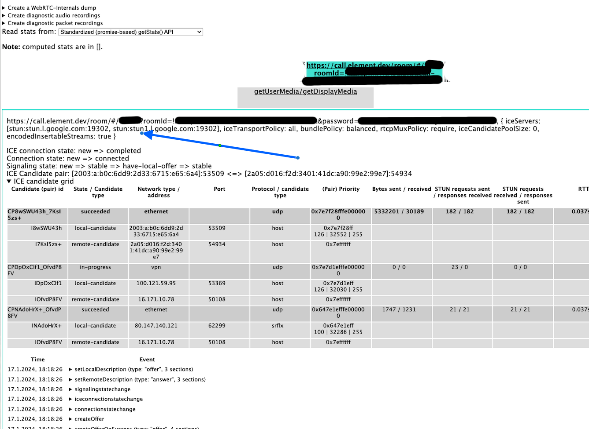
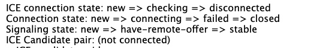

<!--
Copyright 2025 New Vector Ltd
Copyright 2025-2026 Element Creations Ltd

SPDX-License-Identifier: AGPL-3.0-only
-->

# Troubleshooting

## Matrix RTC

### Error Code: `MISSING_MATRIX_RTC_FOCUS` when setting up a call

Matrix RTC must be able to fetch details of where the SFU and authorisation services are hosted. This is achieved by making requests to the Matrix client well-known file at `https://<server name>/.well-known/matrix/client`. This must happen over a HTTPS connection and the browser must trust the TLS certificates presented for this connection.

- Confirm that Matrix RTC isn't disabled in your deploy with `matrixRTC.enabled: false` (it is default enabled)
- Confirm `wellKnownDelegation` isn't disabled in your deploy with `wellKnownDelegation.enabled: false` (it is default enabled)
- Confirm the value of `serverName` is accessible over HTTPS and returns JSON: `https://<server name>/.well-known/matrix/client`
  - Confirm that the response body includes `org.matrix.msc4143.rtc_foci`
  - Confirm that the value of `livekit_service_url` is the value of `matrixRTC.ingress.host` with `https://` prefixed
- Confirm the value of `matrixRTC.ingress.host` is accessible over HTTPS and returns a HTTP 405: `https://<matrixRTC.ingress.host>/sfu/get`

If your `serverName` is accessible with public DNS over the internet you can use https://federationtester.matrix.org/ to validate that it is accessible and has a generally trusted TLS certificate.

### Matrix RTC authoriser logs say `Failed to look up user info`

The Matrix RTC authoriser must be able to query Matrix servers (including your own) to determine who is attempting to connect to it. It uses the Matrix Federation APIs for this.

As a result the authoriser `Pod` must be able to reach both the `https://<server name>/.well-known/matrix/server` endpoint and `https://<synapse.ingress.host>/_matrix/federation/v1/openid/userinfo` (amongst other things). Symptoms of problems in this area include logging in the authoriser `Pod` saying it can't connect to port `8448`

- Confirm `wellKnownDelegation` isn't disabled in your deploy with `wellKnownDelegation.enabled: false` (it is default enabled)
- Confirm the value of `serverName` is accessible over HTTPS and returns JSON: `https://<server name>/.well-known/matrix/server`
  - Confirm that the value of `m.server` is the value of `synapse.ingress.host` with `:443` suffixed
- Confirm the value of `synapse.ingress.host` is accessible over HTTPS and returns JSON: `https://<synapse.ingress.host>/_matrix/key/v2/server`

If these all work outside of the cluster, it maybe that the `Pods` inside the cluster can't access them. You can tell the Matrix RTC authoriser to directly hit your ingress controller IP

```yaml
matrixRTC:
  hostAliases:
  - hostnames:
    - ess.localhost
    - mrtc.ess.localhost
    - synapse.ess.localhost
    ip: '<the spec.clusterIP of your Ingress Controller's Service>'
```

If you are using a TLS certificate signed by a certificate authority that isn't in standard TLS trust stores (i.e. it is own your) you will need to disable TLS verification in the Matrix RTC authoriser with

```yaml
matrixRTC:
  extraEnv:
  - name: LIVEKIT_INSECURE_SKIP_VERIFY_TLS
    value: YES_I_KNOW_WHAT_I_AM_DOING
```

### Matrix RTC SFU is stuck in `CrashLoopBackOff` without any log

This typically means that the SFU is attempting to perform a STUN request to resolve its advertised IP address, and it is failing.

By default, the SFU tries to connect to Google's STUN servers. You can try the following:

- Ensure that the SFU can reach the Google STUN servers.
- Change the STUN servers configured in the Matrix RTC SFU.
- Force the SFU to use a manual IP address instead of relying on STUN to resolve the advertised IP.

For more information about the SFU networking, see [Matrix RTC Networking](./advanced.md#networking).

### SFU Connectivity troubleshooting

The SFU traffic flow is as follows:

1. Device -> (DNS resolution of `<SFU FQDN>`) -> `<HTTPS Requests/Websocket>` --> `cluster (Ingress host of <SFU FQDN>)` to open the signaling channel
1. Signaling channel is opened
1. Device do a STUN resolution against the stun server configured in ElementCall. If not STUN server is configured, it fallbacks to google stun servers
1. Device advertise its access IP through the signaling channel
1. SFU advertise its IP through the signaling channel
1. The connection uses UDP and tries to do `Device Access IP` <-> `<Network>` <-> `IP Advertised by the SFU`

#### SFU IP Advertise modes

You can configure how the SFU chooses the IP it advertises using 3 options:

1. Host IP: The SFU will advertise the Host IP. (`matrixRTC.sfu.useStunToDiscoverPublicIP: false`, `matrixRTC.sfu.manualIP` undefined)
1. Manual IP: You decide which IP the SFU should advertised  (`matrixRTC.sfu.useStunToDiscoverPublicIP: false`, `matrixRTC.sfu.manualIP: <ip>` )
1. STUN (`matrixRTC.sfu.useStunToDiscoverPublicIP: true`, `matrixRTC.sfu.manualIP` undefined)

##### Host IP

A direct IP route must exist between the devices and the Node IP. Therefore, the Node IP should be in a public network.

If you are working on Kubernetes deployment, you might want to have dedicated nodes with an IP in the public network. You can configure `nodeSelectors` and `tolerations` on the workloads to force the SFU to be started on this publicly accessible nodes.

#### Manual IP

The IP advertised by the SFU should be able to forward packets to the SFU pod.

This mode can be used if you are configuring your SFU behind a LoadBalancer. In this case, the device would sent its UDP packets to the Load Balancer, on the same ports as the one expected by the SFU. The Load Balancer will forward the packets to the SFU ports.

#### STUN

The SFU will determine its public IP using STUN. It needs a working STUN server, and by default will use Google stun servers.

This mode can be used if you are behind a NAT Gateway. Routing from the SFU to the STUN Server should traverse the NAT gateway, to successfully resolve the Access IP.

### Device debugging tools

#### In ElementWeb

Make sure ElementCall is enabled in the room you are testing it. You can check under `Room settings -> VoIP -> Enable ElementCall`

#### Verify STUN resolution

##### On Mac

On mac, you can install the homebrew formula [stuntman](https://formulae.brew.sh/formula/stuntman). Once installed, you can use `stunclient` to verify which IP the stun resolution discovers from a device: `stunclient --protocol udp <coturn fqdn>  <stun port>`

The result should be the access IP that the SFU can request.

##### On Linux

On Linux, you can install the `coturn` package. Once installed,  you can use `turnutils_stunclient` to verify which IP the stun resolution discovers from a device: `turnutils_stunclient -p <stun port> <coturn fqdn>`

##### On Windows

On Windows, you can install [stuntman](https://www.stunprotocol.org/) cygwin package. Once installed, you can use `stunclient` to verify which IP the stun resolution discovers from a device: `stunclient --protocol udp <coturn fqdn>  <stun port>`

#### About:WebRTC

While Running an ElementCall session, you can open the WebRTC tools of Chrome (`chrome://webrtc-internals`) or Firefox (`about:webrtc`) to find which IPs are discovered, and which connections are failing.

For example, in the screenshot below, using chrome tools, you can find the following information:

1. The blue arrow points to the stun server that the device uses to discover its IP. They are the ones configured into ElementCall.
1. ICE Connection State says `New` -> `Completed` and worked correctly
1. Connection state says `New` -> `Connected` and worked correctly
1. The Signaling state says `New` -> `Stable` -> `Have-Local-Offer` -> `Stable` and worked correctly

The table contains the ICE Candidates pairs, and we can find the SFU Advertised IP as expected. The blue arrow points to the STUN Server that the clients will use to resolve their own IP address. It must be reachable from the clients.



And example which would fail could show in the informations, where we can see that the connection sent through the signaling channel failed to open:



#### Verify connection

`netcat` can be used to test that the device is able to contact the SFU Pod. As UDP does not have ACK, a successful connection might not be enough to prove that the device is able to contact the SFU Pod on the UDP port.

```shell
➜ nc -vnzu 192.100.0.2 30882
Connection to 192.100.0.2 port 30882 [udp/*] succeeded!
➜ nc -vnz 192.100.0.2 30881
Connection to 192.100.0.2 port 30881 [tcp/*] succeeded!
```

## General / multiple components

### Address family not supported by protocol

Components are configured by default to receive traffic over both IPv4 or IPv6.
This works in general on single-stack clusters as well as dual-stack clusters.
In some clusters where IPv6 is disabled at boot or compiled out of the kernel this may not work.

Set `networking.ipFamily: ipv4` to only bind to IPv4 and disable IPv6 support.
